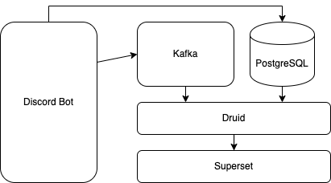

# Discord AI Analytics Bot

## I. Purpose:

To demonstrate the data streaming pipelines by implementing the modern data stack.

## II. Goal:
- Streaming message data:\
`bot -> kafka -> druid -> superset`
- Detect hate speech in the Discord Server

## III.  Tech Stack:


- Language: Python 3.9
- Data Source: Discord Bot
- Storage Layer: PostgreSQL
- Streaming Layer: [Apache Kafka](https://kafka.apache.org/)
- Analytics Layer: [Apache Druid](https://druid.apache.org/)
- Visualization Layer: [Apache Superset](https://superset.apache.org/)

## IV. Infastructure:


## V. Set Up

Due to the scope and purpose of this project, everything will be running in docker containers via simple make commands. Thus, it is essential to have `make`, `docker` and `docker-compose` properly installed. 
#### Pre-requested:
- make
- docker & docker-compose
- Platform: Mac or Linux (for automatic setup to work)
- Minimum 12GB memory allocated for Docker

#### Setup:
- Step 1.\
`make setup`
- Step 2.1.\
Fill in your Discord Bot Token in .env file
- Step 2.2.
    - Add `TALISMAN_ENABLED=False` in the `superset` service as an extra environment variable in Superset's docker-compose.yml
    - Add the below networks block in Superset's docker-compose.yml
    ```YAML
    networks:
        discord:
            name: discord_ai_bot_network
            external: true
    ```
    - Add the below for all services in Superset's docker-compose.yml
    ```YAML
    networks:
      - discord
    ```
    - Comment out or remove the below in `superset-tests-worker` service in Superset's docker-compose.yml
    ```YAML
    network_mode: host
    ```
- Step 3.\
`make kafka`\
Note 1: This step will create a `messages` topic by default\
Note 2: Please make sure all containers are up and running before moving to the next step.
- Step 4.\
`make bot`\
Note 1: This step will instantiate the bot and make the connection to kafka
- Step 5.\
Install the Bot on your Discord Server and type some texts in the Discord channel for testing. Monitoring the Discord Bot log to see if there are any errors.
- Step 7.\
`make druid`\
Note 1: kafka host: `broker:29092`\
Note 2: kafka topic: `messages`

- Step 8. \
`make superset`\
Note 1: Druid connection URL: `druid://<druid_router_ip>:8888/druid/v2/sql`

## VI. Development Tutorial:
TODO

## VII. Learning Resources:

#### Discord:
- [Doc: discord.py API Documentation](https://discordpy.readthedocs.io/en/stable/)
- [stack overflow: bot cogs usage](https://stackoverflow.com/questions/53528168/how-do-i-use-cogs-with-discord-py)

#### Apache Kafka:
- [Doc: confluent-kafka API Documentation](https://docs.confluent.io/platform/current/clients/confluent-kafka-python/html/index.html)
- [Youtube: Listener and Advertised Listener Explaination](https://www.youtube.com/watch?v=L--VuzFiYrM&ab_channel=OttoCodes)
- [Github: Confluent Kafka docker-compose Template](https://github.com/confluentinc/cp-all-in-one/tree/7.5.0-post)

#### Apache Druid:

#### Apache Superset: